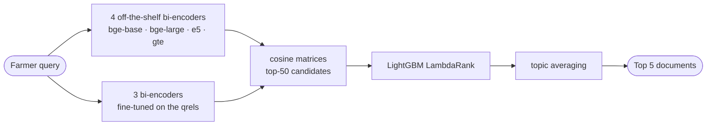

# Donga — Agricultural Extension RAG

Retrieval for the Kaggle competition *Agricultural Extension RAG: Smart
Retrieval for Farmers*: given a farmer's question, rank the 5 most relevant
documents from a 695-document corpus. Metric **nDCG@5**.

**Final submission: 0.92795 public / 0.92594 private — 4th place**, against a
TF-IDF baseline of 0.551.

Three of the seven encoders below are `bge` models fine-tuned on the
competition's own relevance judgements; those fine-tunes carried essentially
all of the gain.

## Dataset

The competition dataset, used as issued — nothing added to or removed. All six
CSVs are committed under [data/](data/) (496 KB), so the submission reproduces
from a fresh clone with no Kaggle account: `documents.csv` (695 factsheets on
crop diseases, pests, nutrient deficiencies, soil, fertiliser, climate),
`train_queries.csv` (308 farmer-style questions), `qrels_train.csv` (graded
relevance, 3 = perfect … 0 = irrelevant, ~14 judged per query),
`test_queries.csv` (200 held-out questions).

Two properties drove every design decision. **Train and test topics are
disjoint** — 0 of 305 topic phrases overlap — so nothing keyed to a specific
crop or disease can generalise. And **queries arrive in template families**
("How do I cope with X on my farm?"), so the topic phrase carries the signal
and the wrapper does not.

We also *created* data: [scripts/synth.py](scripts/synth.py) re-wraps document
titles into those templates for 1,656 synthetic pairs. It made the model worse
and is not in the submission.

## Training Pipeline



**Preprocessing.** Document text is the title weighted ×2 plus body. Queries
stay verbatim: stripping the template cost ~0.011, so it is grammar the
encoders use.

**Stage 1 — fine-tuning** (Colab T4, [notebooks/](notebooks/)).
`MultipleNegativesRankingLoss` over (query, positive, hard negative) triplets,
negatives mined from the base model's own top-ranked mistakes, two seeds
averaged. `gte-large` ships fp16 weights that overflow Adam, so it needs
`torch_dtype=torch.float32`.

**Stage 2 — LambdaRank fusion.** LightGBM (`n_estimators=300`, `lr=0.05`,
`num_leaves=31`, `min_child_samples=10`) over per-candidate features: raw
cosine per encoder, rank, per-query z-score, margin to best, BM25, crop and
country match. Raw cosines are not comparable across queries — hence the
z-score and margin.

**Stage 3 — topic averaging.** Queries sharing a topic phrase should retrieve
the same documents, so their score rows are averaged, cancelling phrase noise.

**Hyperparameter search.** Candidate depth `TOP_K` was settled on the
leaderboard, not locally: K=20 → 0.91921, **K=50 → 0.92795**, K=350 → 0.92686.
Local CV rises monotonically with depth and is simply wrong.

## Evaluation

Scored with **nDCG@5**, implemented in [src/pipeline.py](src/pipeline.py).

**The local CV is inflated and cannot referee tuning decisions.** The
fine-tuned encoders trained on all 308 train queries, so in 5-fold CV grouped
by topic family the held-out queries were already seen by the encoder. Honest
CV needs an out-of-fold fine-tune per fold. Two honest signals instead:

1. **A Colab topic-grouped holdout** excluding validation topics from the
   fine-tune itself: bge-base off the shelf 0.8191 → fine-tuned on random
   negatives 0.8893 → bge-large on mined hard negatives 0.9225.
2. **The leaderboard, with ablations.** Stage 2 removed (`submit-blend`)
   scored 0.90173 against 0.92795, putting LambdaRank at roughly +0.026.

Every rejected idea was tested the same way and logged with its numbers in
[docs/experiments.md](docs/experiments.md): query expansion, synthetic queries,
cross-encoder reranking, BM25 fusion, a ridge adapter.

## Reproduction

```bash
pip install -r requirements.txt
python scripts/ltr.py submit        # writes submission.csv
```

**No Kaggle credentials needed** — the dataset is in [data/](data/) and the
fine-tuned embeddings (`ft_embs*.npz`) are committed. Verified: the output is
byte-identical to the `submission.csv` here, the file scored 0.92795. The first
run embeds the corpus (~3 min on CPU), cached to `/tmp/donga_emb`; later runs
take seconds.

Other entrypoints: `ltr.py eval` (grouped CV, inflated), `ltr.py submit-blend`
(ablation without the ranker), `synth.py` and `rerank_submit.py` (the negative
results), `sweep.py` (encoder comparison), `package.py` (archive),
`download_data.py` (refetch from Kaggle — the only script wanting a token, read
from `~/.kaggle/kaggle.json`, never the repo). Regenerating the fine-tunes
needs a GPU: upload a notebook from [notebooks/](notebooks/) to Colab (T4) —
the table in [docs/experiments.md](docs/experiments.md) says which does what.

    docs/       four challenge cards (.pdf) + experiments.md
    scripts/    ltr.py (submitted pipeline) · synth · rerank_submit
                sweep · finetune · download_data · package
    src/        pipeline.py — retrieval, fusion, nDCG@5, submission writer
    notebooks/  colab_* — GPU fine-tunes (.py per cell + .ipynb)
    data/       competition CSVs
    README.md · submission.csv · ft_embs*.npz · ce2_scores.npz

## Appendix

**Contributors** — Abubakar Diallo ([@Dialloni](https://github.com/Dialloni)):
modelling, retrieval pipeline, fine-tuning, experiments. Dilrabo Khidirova
([@iftihorbekd](https://github.com/iftihorbekd)): problem framing, data card,
impact and stakeholder analysis.

**Mentors** — *[to be filled]*

**Cohort Challenges** (AI Saturdays Lagos, C10) —
[problem statement](docs/problem_statement.pdf) ·
[data card](docs/data_card.pdf) ·
[impact statement](docs/impact_statement_card.pdf) ·
[stakeholder engagement](docs/stakeholder_engagement.pdf)

## References

- Competition: [Agricultural Extension RAG: Smart Retrieval for Farmers](https://www.kaggle.com/competitions/agricultural-extension-rag-smart-retrieval-for-farmers)
- Full experiment log, every negative result with numbers: [docs/experiments.md](docs/experiments.md)
- Encoders: [BAAI/bge-base-en-v1.5](https://huggingface.co/BAAI/bge-base-en-v1.5), [BAAI/bge-large-en-v1.5](https://huggingface.co/BAAI/bge-large-en-v1.5), [intfloat/e5-large-v2](https://huggingface.co/intfloat/e5-large-v2), [thenlper/gte-large](https://huggingface.co/thenlper/gte-large)
- Reimers & Gurevych, *Sentence-BERT* (EMNLP 2019); Ke et al., *LightGBM* (NeurIPS 2017); Burges, *From RankNet to LambdaRank to LambdaMART* (2010)
