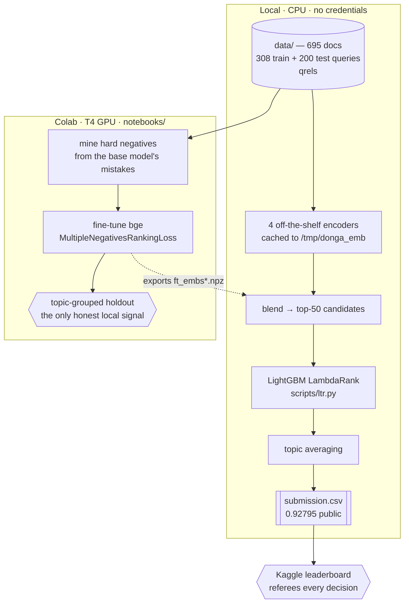

# Experiment log

Everything we tried, with numbers — including the things that did not work.
The [README](../README.md) carries the submitted system; this file carries the
evidence behind it.

Final submission: **0.92795 public / 0.92594 private, 4th place.**

## How the pieces fit together

Fine-tuning needs a GPU and runs in Colab; everything else runs locally on CPU.
The `.npz` files are the handoff between the two.

The dotted edge is the only manual step: a notebook downloads `ft_embs*.npz`,
you drop it in the repo root, and `ltr.py` picks it up as an extra encoder. All
three that made the submission are already committed, so the local path runs
start-to-finish without touching Colab.

## Leaderboard history

| Submission | Public LB |
|---|---|
| TF-IDF baseline (organisers) | 0.55100 |
| bge-base dense retrieval | 0.82640 |
| 4-encoder blend + LightGBM LambdaRank | 0.86954 |
| + bge-base fine-tuned on the qrels (Colab) | 0.91880 |
| + bge-large fine-tuned, hard negatives, 2 seeds | 0.92734 |
| **7-encoder ensemble, candidate depth K=50 (submitted)** | **0.92795** |
| same, candidate list deepened to K=350 | 0.92686 |
| same, candidate list shortened to K=20 | 0.91921 |
| ablation: encoder blend only, no LambdaRank stage | 0.90173 |

Fine-tunes are measured in Colab on a topic-grouped holdout that excludes the
validation topics from training, which is the only honest local signal we have
(see the CV caveat below):

| Encoder | Holdout nDCG@5 |
|---|---|
| bge-base, off the shelf | 0.8191 |
| bge-base, fine-tuned, random negatives | 0.8893 |
| **bge-large, fine-tuned, mined hard negatives** | **0.9225** |
| bge-large, + synthetic queries mixed into training | 0.9165 |

## What worked

- **Fine-tuning on the qrels is the whole game.** Every leaderboard jump came
  from a better fine-tuned encoder; feature engineering on top of them has been
  worth roughly nothing.
- **Hard negatives beat random negatives** by a wide margin (0.8893 → 0.9225 on
  holdout, though the model size also changed).
- **The ensemble tolerates a weaker member.** The synthetic-data encoder scores
  *worse* alone (0.9165 vs 0.9225) yet *improves* the blend, because it errs
  differently from the others. Ensemble contribution and solo score are
  separate questions.
- **The LambdaRank stage is worth ~0.026** — the blend-only ablation scored
  0.90173 against 0.92795.
- **Per-query normalisation in the ranker features.** Raw cosines are not
  comparable across queries — an easy query scores 0.9 against everything — so
  every score matrix also contributes a z-score and a margin-to-best.
- **Topic averaging.** Queries arrive in template families ("How do I cope with
  X on my farm?" / "What is the risk of X to farming?"). Queries sharing a
  topic phrase should retrieve the same documents, so their score rows are
  averaged, which cancels per-phrasing noise.

## What did not work

Each tested, with numbers.

- **Query expansion with crop synonyms.** Appending synonyms (maize→corn,
  groundnut→peanut, fertiliser→fertilizer, ...) to 241 of 308 queries lowered
  every off-the-shelf encoder and the blend, 0.8415 → 0.8368. This was an
  honest test — nothing was trained, so the train set is unbiased here. The
  encoders already model the synonymy and the extra tokens only dilute the
  query embedding.
- **Synthetic training queries.** [scripts/synth.py](../scripts/synth.py)
  parses each document title back into its topic phrase and re-wraps it in the
  train query template families, yielding 1,656 pairs covering all 695
  documents. The motivation was real: train and test topics are disjoint, so
  test-only phrases (iron / magnesium / sulphur deficiency) are never seen
  during fine-tuning. Mixed into training at 2:1 against real triplets, holdout
  *dropped* to 0.9165. The likely mechanism is in-batch negatives — synthetic
  queries come in near-duplicates per topic, so the loss pushes apart documents
  that are both relevant.
- **Cross-encoder reranking, both off-the-shelf and fine-tuned.** The
  off-the-shelf `bge-reranker-base` lost 0.006 against the bi-encoder alone.
  A `bge-reranker-v2-m3` fine-tuned on the qrels with mined hard negatives did
  no better: blending its scores with the bi-encoder blend scored 0.9239
  against the blend's own 0.9207 — and that comparison *flatters* the reranker,
  which had trained on those exact queries. An in-sample model that gains
  +0.003 will not gain out of sample, so it stayed out of the submission.
  Reproduce with [scripts/rerank_submit.py](../scripts/rerank_submit.py) over
  the committed `ce2_scores.npz`.
- **Lexical retrieval.** Every RRF weight on BM25 lowered the score
  monotonically, so BM25 is out of the submission path as a retriever; it
  survives only as one feature column for the ranker.
- **Stripping query boilerplate.** Removing the template wording cost ~0.011 on
  BM25 rather than helping — the template is not noise, it is grammar the
  encoders use.
- **A ridge "linear adapter"** mapping query embeddings onto their positive
  centroid scored 0.69 in CV; it memorises train topics and does not transfer.

## Methodology notes

- **The local CV is inflated and cannot referee tuning decisions.** The
  fine-tuned encoders trained on all 308 train queries, so in cross-validation
  the held-out queries were already seen by the encoder. Trustworthy CV would
  need out-of-fold fine-tunes, one per fold — five Colab runs per experiment.
  The Colab topic-grouped holdout is the substitute: it excludes validation
  topics from the fine-tune itself.
- **Candidate depth K=50 is a genuine optimum, found only on the leaderboard.**
  CV rises monotonically with depth (K=350 gains 0.019 over K=50) and is simply
  wrong: the leaderboard peaks at 50 and falls off on both sides.

  | Candidate depth | Public LB |
  |---|---|
  | K=20 | 0.91921 |
  | **K=50** | **0.92795** |
  | K=350 | 0.92686 |

  Going shallower was a deliberate test of the hypothesis that unjudged
  documents inside the candidate window act as label noise — only ~14 documents
  per query are judged, so at K=50 most training rows are unjudged documents
  labelled irrelevant, and the corpus is full of near-duplicate zone variants
  that are plausibly relevant. The hypothesis was wrong, and the cost of the
  extra label noise is smaller than the cost of a truncated candidate list.
- **Ranker-side tuning is exhausted.** Averaging LightGBM over 5 seeds changes
  the CV by 0.0000 (the model is deterministic without subsampling), and
  mixing the ranker's output back with the plain encoder blend is worse at
  every weight tried (0.9613 at alpha=0.9, 0.9604 at 0.8, against 0.9634 for
  the ranker alone).
- **This is not pooling bias.** At K=350 the ranker's top-5 are *less* likely
  to be judged documents (0.856) than the plain blend's (0.870), so it is not
  simply learning to recognise the training pool.
- **gte-large diverges to NaN when fine-tuned on Colab.** Its Hub weights are
  fp16 and sentence-transformers honours that dtype, so Adam without loss
  scaling overflows. Force `torch_dtype=torch.float32`.
- **Train and test topics are disjoint** (0 of 305 overlap), so nothing that
  keys on a specific crop or disease will generalise.

## Colab notebooks

Fine-tuning needs a GPU, so it runs in Colab (T4). Upload the `.ipynb`, or
paste the `.py` into a cell after `kagglehub.login()`. Each notebook prints its
holdout score, then downloads embeddings to drop in the repo root.

| Notebook | Exports | Holdout | In submission |
|---|---|---|---|
| [colab_finetune.py](../notebooks/colab_finetune.py) | `ft_embs.npz` | 0.8893 | yes |
| [colab_finetune2.py](../notebooks/colab_finetune2.py) | `ft_embs2.npz` | 0.9225 | yes |
| [colab_finetune4.py](../notebooks/colab_finetune4.py) | `ft_embs4.npz` | 0.9165 | yes (helps the blend) |
| [colab_finetune3.py](../notebooks/colab_finetune3.py) | `ft_embs3.npz` | diverged, fp32 fix | no |
| [colab_finetune5.py](../notebooks/colab_finetune5.py) | `ft_embs5.npz` | curriculum variant | no |
| [colab_rerank2.py](../notebooks/colab_rerank2.py) | `ce2_scores.npz` | see above | no |

Any `ft_embs*.npz` in the repo root is picked up as an extra encoder
automatically; files containing NaN are skipped with a warning. Off-the-shelf
encoder embeddings cache to `/tmp/donga_emb`, so only the first run pays for
them.
